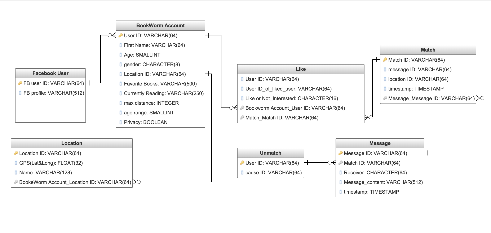

# Bookworm

Brian Martinez / April 9, 2018 

## Bookworm Proposal  
	"We need to make books cool again. If you go home with somebody and they dont have books, don't have sex with them" John Waters
	Bookworm is my attempt at making a simple social media matching application like tinder for bookworms. 
	Sign up/Login through Facebook.
	Manage User profile and set discovery preferences.
	Swipe to Like/Dislike a profile.
	Real Time Chat.
	Push notifications.
	Geopositioning/GeoTagging.
	A Match Making Algorithm.

## Entity Relationship Diagram

## Wireframe 

## User Stories  
	User 1 - 32 year old male, avid reader, recent break up, looking for a women to enjoy silence with. 

	User 2 - 28 year old female, sapiosexual, enjoy going on vacation and enjoying a good book

	User 3 - 50 year old female, well off widow, donates to local libraries, lonely
    

## Technology

	React Native with Express

## Extras

## Timeline
    _ Monday CODE
    _ Tuesday CODE
    _ Wednesday CODE/Life
    _ Thursday CODE
    _ Friday CODE
    _ Saturday FRANTICALLY CODE/Life
    _ Sinday FRANTICALLY CODE/Life
    _ Monday FRANTICALLY CODE until Presentation!

## Obstacles
	Figuring out matching algorithm

## Links and Resources   

https://github.com/barndogghxc/bookworm
