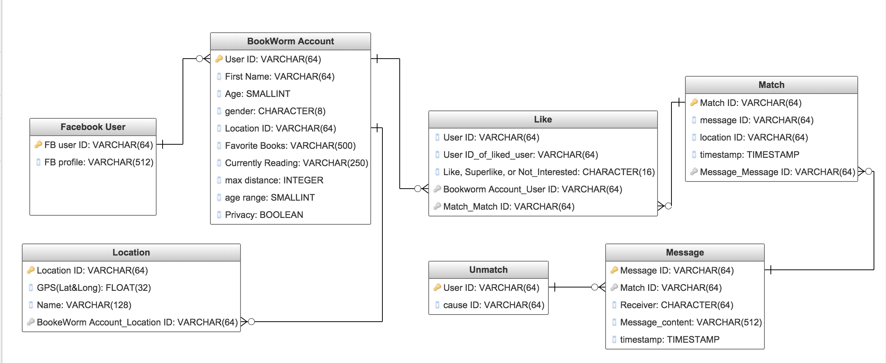
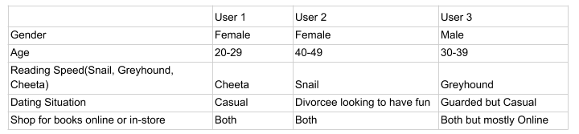

# Bookworm

Brian Martinez / April 9, 2018 

## Bookworm Proposal  
	"We need to make books cool again. If you go home with somebody,
	and they dont have books don't have sex with them" - John Waters
	Bookworm is my attempt at making a simple social media matching application like tinder for bookworms. 
	Sign up/Login through Facebook.
	Manage User profile and set discovery preferences.
	Swipe to Like/Dislike a profile.
	Real Time Chat.
	Push notifications.
	Geopositioning/GeoTagging.
	A Match Making Algorithm.

## Entity Relationship Diagram

## Wireframe 

## User Stories  

## Technology

	React Native with Redux

## Extras

## Timeline
    _ Monday CODE
    _ Tuesday CODE
    _ Wednesday CODE/Life
    _ Thursday CODE
    _ Friday CODE
    _ Saturday FRANTICALLY CODE/Life
    _ Sinday FRANTICALLY CODE/Life
    _ Monday FRANTICALLY CODE until Presentation!

## Obstacles
	Figuring out matching algorithm

## Links and Resources  
	Expo Docs 
	https://docs.expo.io/versions/latest/
	React Navigation Docs
	https://reactnavigation.org/docs/getting-started.html
	Redux Docs
	https://redux.js.org/
	Facebook Login Docs
	https://developers.facebook.com/docs/facebook-login/ios
	https://docs.expo.io/versions/latest/sdk/facebook.html
	Firebase Docs
	https://firebase.google.com/docs/
	https://docs.expo.io/versions/latest/guides/using-firebase.html
	https://firebase.google.com/docs/database/web/read-and-write
	AWS Images Docs
	https://docs.expo.io/versions/latest/sdk/imagepicker.html
	https://docs.aws.amazon.com
	https://github.com/benjreinhart/react-native-aws3
	Github Repo Link
	https://github.com/barndogghxc/bookworm
